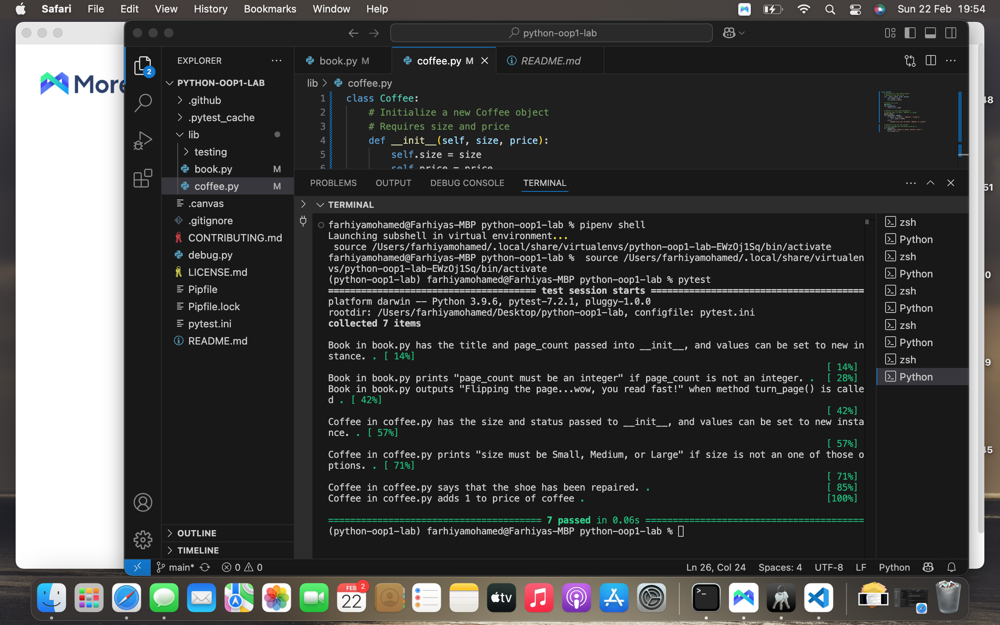

# Python OOP Bookstore Lab

## Overview
This project models a bookstore using Object-Oriented Programming in Python.

Two classes were created:
- Book
- Coffee

The project follows Test-Driven Development (TDD).

---

## Book Class

### Attributes
- title
- page_count (must be an integer)

### Methods
- turn_page() → prints:
  "Flipping the page...wow, you read fast!"

Validation ensures page_count must be an integer.

---

## Coffee Class

### Attributes
- size (Small, Medium, or Large)
- price

### Methods
- tip() → prints:
  "This coffee is great, here’s a tip!"
  and increases the price by 1.

Validation ensures size must be Small, Medium, or Large.

---

## Testing

All tests pass successfully using pytest.

### Test Results Screenshot

# Python OOP Bookstore Lab

## Overview
This project models a bookstore using Object-Oriented Programming in Python.

Two classes were created:
- Book
- Coffee

The project follows Test-Driven Development (TDD).

---

## Book Class

### Attributes
- title
- page_count (must be an integer)

### Methods
- turn_page() → prints:
  "Flipping the page...wow, you read fast!"

Validation ensures page_count must be an integer.

---

## Coffee Class

### Attributes
- size (Small, Medium, or Large)
- price

### Methods
- tip() → prints:
  "This coffee is great, here’s a tip!"
  and increases the price by 1.

Validation ensures size must be Small, Medium, or Large.

---

## Testing

All tests pass successfully using pytest.

### Test Results Screenshot

